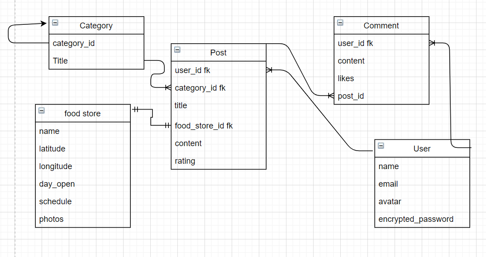

# Food Good

This project involves the creation of an application to food stores that are small or that do not belong to the best known. with the aim of knowing new places in your area

## Table of Contents
* [Heroku link](#heroku-link)
* [User History](#user-history)
* [Ruby & Rails version](#rails-version)
* [Basic Usage](#basic-usage)
* [Ruby & Rails Gems](#rails-gems)
* [Defining the models](#defining-the-models)
* [Admin User](#Admin-User)
* [Gem for images](#gem-for-images)
* [Add Yarn](#add-yarn)

## User history

```ruby
https://trello.com/b/hLa4PH0r/project
```

## Heroku Link

```ruby
https://food94good.herokuapp.com/
```


## Ruby & Rails version

* ruby '2.5.3'
* gem 'rails', '~> 5.2.6'

## Basic Usage

```ruby
1.- bundle
2.- sudo service postgresql start
3.- rails db:create
4.- rails db:migrate
5.- rails db:seed
6.- create environment variables for 'active storage', 'mach key', 'goggle develoment', 'google email'
7.- rails s
```

## Ruby & Rails Gems

```ruby
gem "faker", "~> 2.19"
gem "bootstrap", "~> 5.1"
gem "jquery-rails", "~> 4.4"
gem 'figaro'
```

## Defining the models



## Admin User

```ruby
- Email = "1@gmail.com"
- Password = "123456"
```

## Gem for images
```ruby
gem 'image_processing', '~> 1.2'
```
ImageMagick must be installed for use
```ruby
sudo apt install imagemagick
```

## Add yarn
```ruby
yarn add highcharts
```

